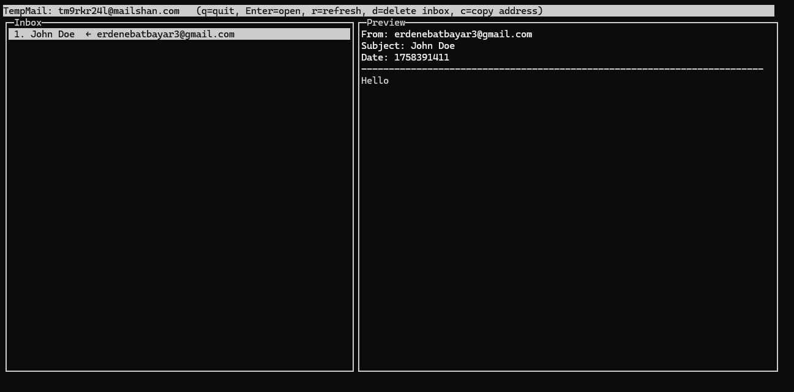

# @syren0914/tempmail-cli

A tiny, powerful CLI to spin up a temporary email inbox, watch it live in a terminal UI, and handle attachments (including images) with ease.



## Quick Start (npm)

The easiest way to use the CLI is to install it globally via npm:

```bash
npm install -g @syren0914/tempmail-cli
tempmail create
```

## Features

- **One-liner UX:** `tempmail create` handles everything.
- **Smart Setup:** Automatically prompts for missing API tokens and opens the login page for you.
- **Live TUI:** Interactive split-pane view for messages and previews.
- **Image Support:** Press `v` to view image attachments in your system's default viewer.
- **Save Attachments:** Press `s` to download all attachments to a local `attachments/` folder.
- **Clipboard support:** Automatically copies the inbox address on creation.
- **Cross-Platform:** Works on Windows, macOS, and Linux.

## Credentials & Setup

To use this CLI, you'll need API credentials from [TempMail.so](https://tempmail.so):

1.  **RAPIDAPI_KEY**: Obtain this from RapidAPI.
2.  **TEMPMAIL_TOKEN**: Obtain this from your TempMail.so account dashboard (Account -> Account Information).

The CLI will guide you through the setup on your first run. Tokens are stored persistently in your system's config directory.

## Usage

```bash
# Create inbox, auto-copy address, and open live TUI
tempmail create

# Options:
#   --minutes 10          lifespan (default 10)
#   --prefix mybox        custom local-part (random if omitted)
#   --domain example.com  choose a specific domain
tempmail create --minutes 5 --prefix myproj
```

## TUI Controls

- **Keyboard:** ↑/↓ select, Enter refresh preview.
- `r`: Refresh inbox.
- `c`: Copy inbox address.
- `v`: View first image attachment.
- `s`: Save all attachments to `./attachments/`.
- `d`: Delete inbox.
- `q`: Quit.

## License

MIT